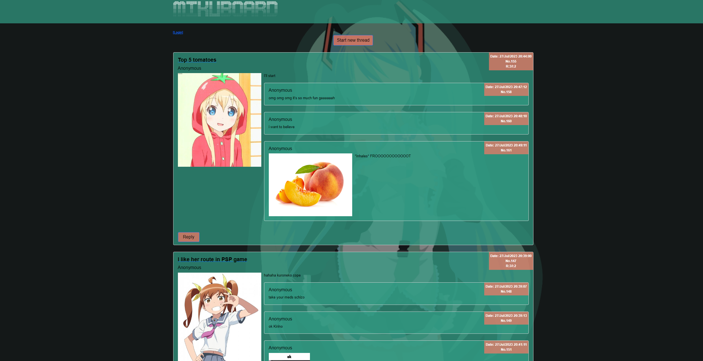
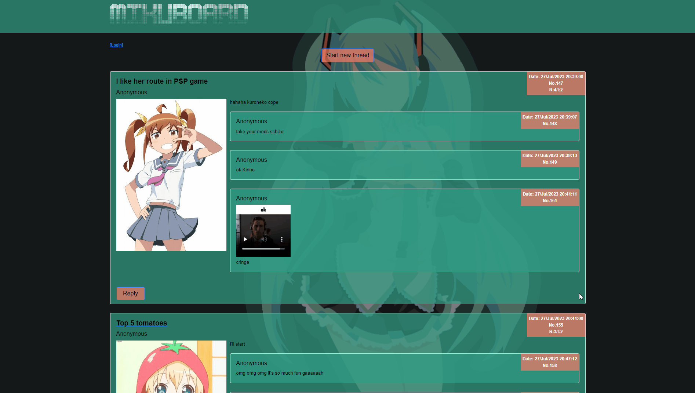
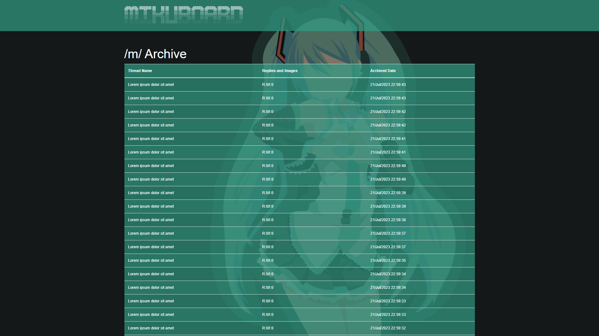
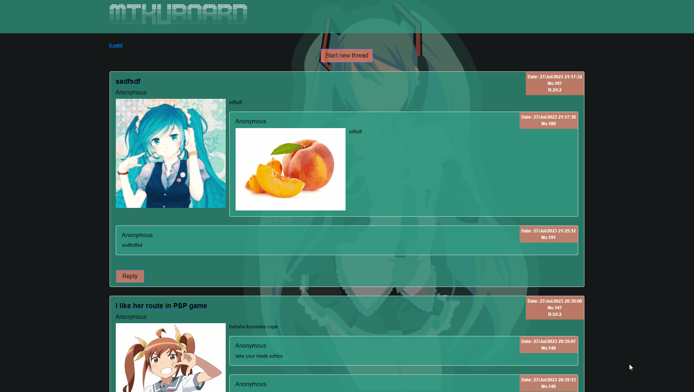

<p align="center">
  
</p>
 
# Mikuboard - Miku-chan (literally)

Mikuboard is an imageboard with functionality similar to various  _-chan_ boards. \
It allows users to post either anonymously, or with username.
The user can start new thread in given category, or post a reply to the existing thread \
The entire backend is based on Java's SpringBoot 3. The website layout has been created with 
mix of Boostrap, CSS and flex.
## Functionality 
### 1.Creating new thread and replying
Users can post threads and replies, if they don't state their username, the default name of 
_Anonymous_ appears, just like on other imageboards. Website validates, whether the user filled thread's 
title and description, same applies to reply.

#### 1.1 Media upload
Media upload is being handled by custom FileStorageService, that creates unique chan-like 
filenames and stores files on the server. 
```java
 public String storeFile(MultipartFile file) {

        String fileName =
                new Date().getTime() + "-img." + getFileExtension(file.getOriginalFilename());

        try {
            Path targetLocation = this.fileStorageLocation.resolve(fileName);
            Files.copy(file.getInputStream(), targetLocation, StandardCopyOption.REPLACE_EXISTING);
            return fileName;

        } catch (IOException ex) {
            throw new RuntimeException("Could not store file " + fileName + ". Please try again!", ex);
        }
    }
```

### 2."Bump" functionality and thread archiving
Mikuboard has only 10 pages, 10 posts per page. Threads are sorted by last reply date. When
the number of active threads exceeds 100 in database, while creating new thread, the oldest is 
being automatically archived, and belongs to archive along with all it's replies.
```java
        Optional<Thread> threadToArchive = threadRepository.findById(thread.getId() - 101);
        if (threadToArchive.isPresent()) {
            threadToArchive.get().setArchived(true);
            threadRepository.saveAndFlush(threadToArchive.get());
        }
```

Only not archived threads are being shown on the site by database custom query.
```java
    @Query("SELECT t FROM Thread t WHERE t.isArchived = FALSE ORDER BY t.bumpedAt DESC")
    List<Thread> findThreadsNotArchived();
```
Threads can be "saved" from archiving by simply posting a reply. Thread with lastest reply 
is being automatically displayed on the top of both main page and catalog. 
Even after deleting a reply by an administrator, the thread still stays refreshed to avoid uncontrolled
archiving of other treads from last page. 

### 3.Posts deleting and administrator authentication
Database includes encrypted credentials of every administrator on given board. \
Authentication is being held by custom AuthProvider and AdminDetailsService. \
Web config restricts posts removal only for administrator role.
```java
 public SecurityFilterChain filterChain(HttpSecurity http) throws Exception {
        http
                .authorizeHttpRequests((requests) -> requests
                        .requestMatchers("/m/delete/**")
                        .hasAuthority("ADMIN")
                        .requestMatchers("/**")
                        .permitAll()
        
...
```
```java
    @Override
    public Authentication authenticate(Authentication authentication)
            throws AuthenticationException {

        String username = authentication.getName();
        String password = authentication.getCredentials().toString();

        UserDetails admin = adminDetailsService.loadUserByUsername(username);
        if (passwordEncoder.matches(password, admin.getPassword())) {
            return new UsernamePasswordAuthenticationToken(
                    username, password, AuthorityUtils.createAuthorityList("ADMIN"));
        } else {
            throw new BadCredentialsException("Username/password mismatch");
        }
    }
```
```java
    @Override
    public UserDetails loadUserByUsername(String username) throws UsernameNotFoundException {

        if (loginRepository.findByName("admin").isEmpty()) {
            throw new UsernameNotFoundException(username);
        }

        LoginCredentials admin = loginRepository.findByName("admin").get();
        return admin;
    }
}
```
After successfull authentication, the administrator can delete posts or the entire threads. \
Cascade property of relation between "Thread" and "Reply" guarantees, that after deleting given thread, 
all the replies are being deleted as well, without making additional requests to database.

Post delete functionality uses XMLHttpRequest to avoid page refreshing after thread delete 
and the usage of another template just to delete post. 
```javascript
...
            const elementToken = document.querySelector('meta[name="_csrf"]');
            const token = elementToken?.getAttribute("content");
            const elementHeader = document.querySelector('meta[name="_csrf_header"]');
            const header = elementHeader?.getAttribute("content");

            xhr.open('POST', '/m/delete/thread/' + threadID, true);
            xhr.setRequestHeader(header, token);
            xhr.send();
...
```